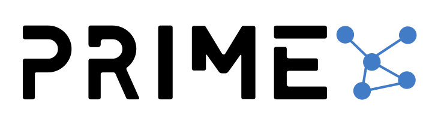

The "Prime" project is a boilerplate for distributed applications. Micro-services are written in Javascript with Hydra Micro-services framework. The client side is written in React, Redux with Single Spa library.

Our target is to create the best solution for fastly bootstrapping the distributed application.

Stay tuned!

## Main features

- Easy to start
- Distributed
- Multi frontend - you and use React, Angular, Vue for client micro-frontends
- Free for all

## Roadmap

- [ ] Create auth micro-service
- [ ] Create client side using simple spa
- [ ] Add Google Auth and Facebook providers as micro-services
- [ ] Create advanced roles and permissions system
- [ ] Add traffic encryption with client for GDPR policy
- [ ] Build new interface for hydra-router with more information about services
- [ ] Add PM2 for starting all micro-services

## License
